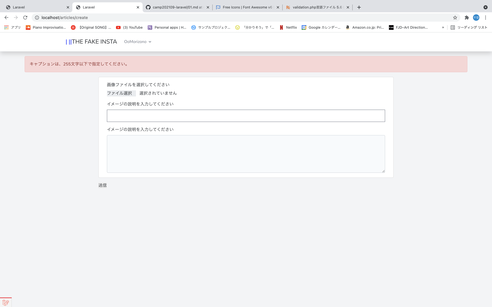

# THE FAKE INSTA

### 実装機能

- CRUD
記事のがCRUDできるようになっています
バリデーションも実装済
- ファイルアップロード
複数の画像を、ファイルアップロードできるようにしました｡
アップロードした画像は、/storage/app/public/articles配下に保存
- 画像の複数表示
show画面にて複数の画像を表示できるようにしました｡
- ログイン機能の実装
google､githubのアカウントでもログイン出来るようにしました｡

### 画面

* 一覧画面

* 詳細画面/Guest

* 詳細画面/login

* 登録画面

* 編集画面

* エラー登録画面

* エラー編集画面

